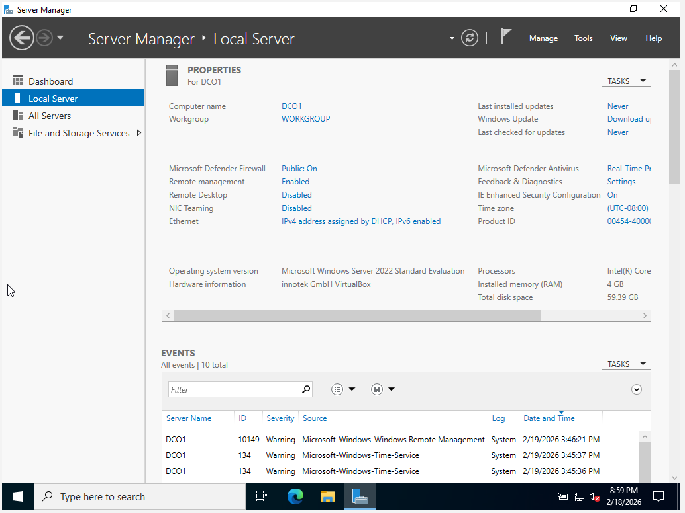
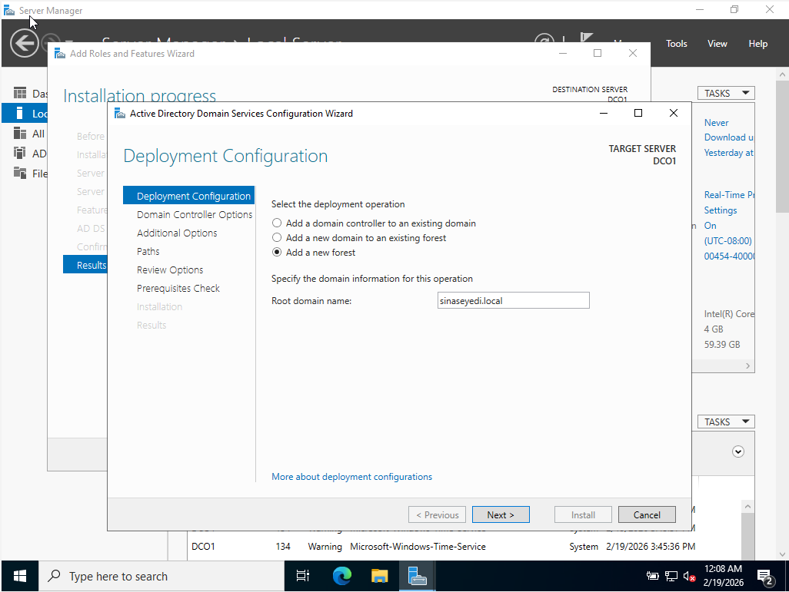
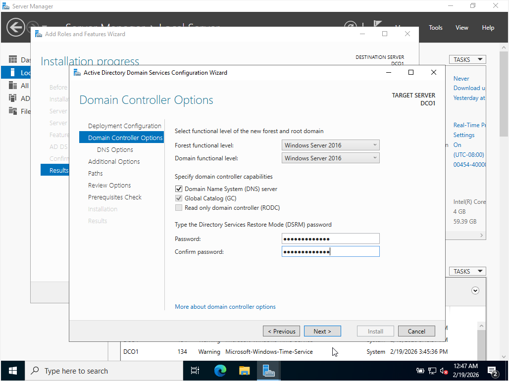

# Domain Controller Deployment

This section documents the deployment of a Windows Server 2022 Domain Controller in a virtual lab environment.

## Actions Performed

- Renamed server to DC01
- Installed Active Directory Domain Services (AD DS)
- Created new forest (sinaseyedi.local)
- Configured DNS and Global Catalog
- Promoted server to Domain Controller

This setup simulates the foundational infrastructure used in enterprise environments.

## Screenshots

### 1. Server Renamed to DC01

### 2. New Forest Creation (sinaseyedi.local)

### 3. Domain Controller Configuration (DNS & Global Catalog Enabled)

