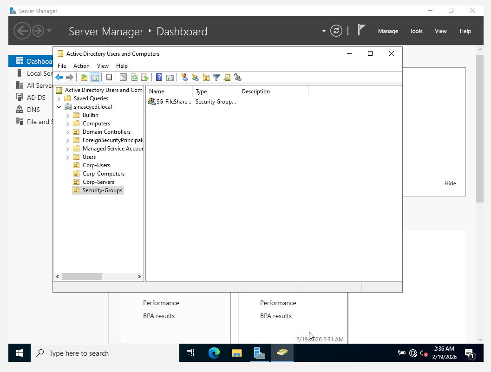

# User Onboarding Process

## Overview

This section demonstrates provisioning a new domain user in Active Directory using structured enterprise practices.

---

## Scenario

A new employee joins the organisation and requires:

- A domain user account
- Correct OU placement
- Security group membership
- Access to shared resources

---

## Step 1 – Create User Account

A new domain user was created inside the Corp-Users OU.

---

## Step 2 – Create Security Group

A security group was created to manage access to shared resources.

---

## Step 3 – Add User to Security Group

The user was added to the security group to grant appropriate access.

---

## Outcome

The user was successfully provisioned using group-based access control and proper OU structure, demonstrating practical Active Directory user lifecycle management.
