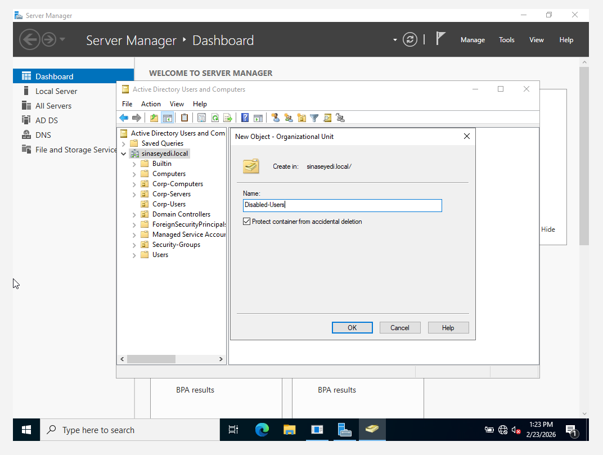
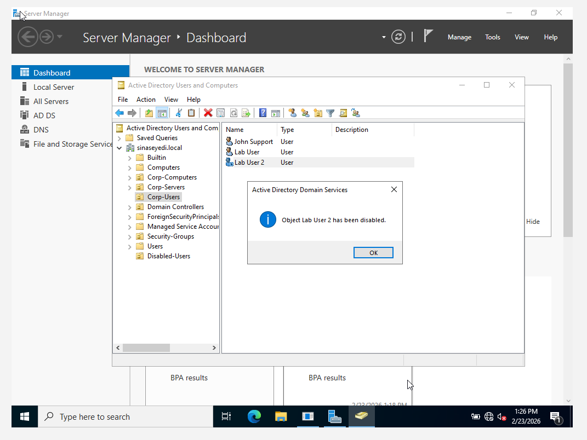
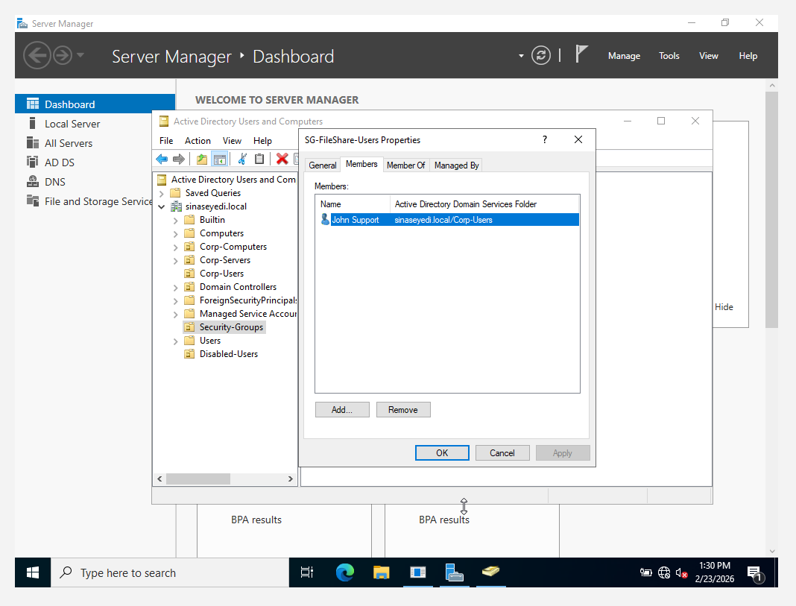
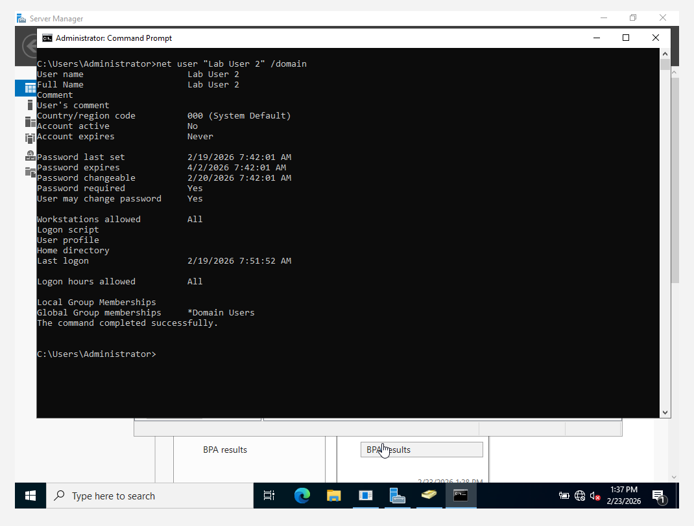
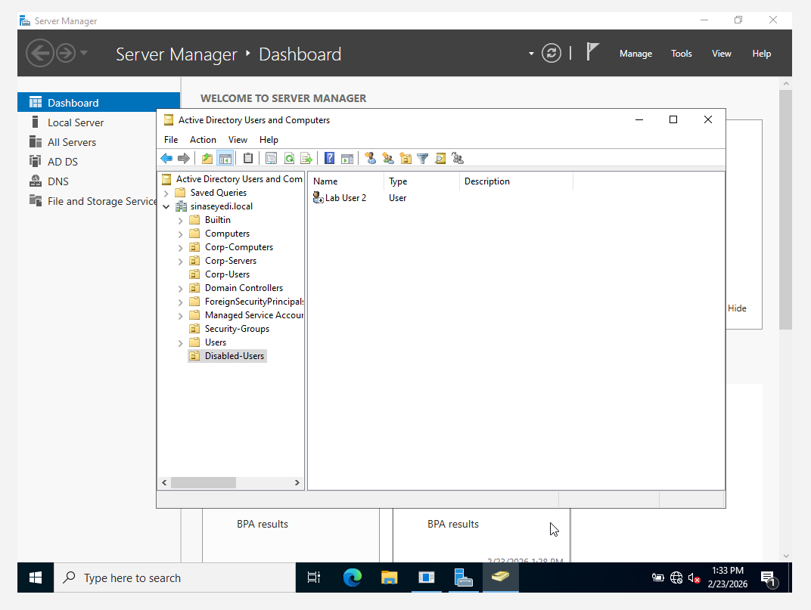

# User Offboarding Process

## Overview

This section demonstrates a structured user offboarding process in Active Directory using Windows Server 2022. The objective is to securely deprovision a departing user and revoke access following enterprise best practices.

---

## Scenario

A user is leaving the organisation and must:

- Have domain access revoked
- Be removed from security groups
- Have their account disabled
- Be moved to a dedicated Disabled-Users OU

---

## Step 1 – Create Disabled Users OU

A dedicated Organizational Unit named **Disabled-Users** was created to store inactive accounts and maintain directory hygiene.

---

## Step 2 – Disable User Account

The user account was disabled to prevent further authentication to the domain.

---

## Step 3 – Remove User from Security Group

The user was removed from the assigned security group to revoke access to shared resources.

---

## Step 4 – Verify Account Status

Account status was verified using:

net user "Lab User 2" /domain

The output confirmed:

- Account active: No

---

## Step 5 – Move User to Disabled Users OU

The account was moved to the **Disabled-Users** OU to separate inactive users from active accounts.

---

## Outcome

The user was successfully deprovisioned with:

- Access revoked  
- Account disabled  
- Group membership removed  
- Directory structure maintained  

This demonstrates practical understanding of secure user lifecycle management in Active Directory.
