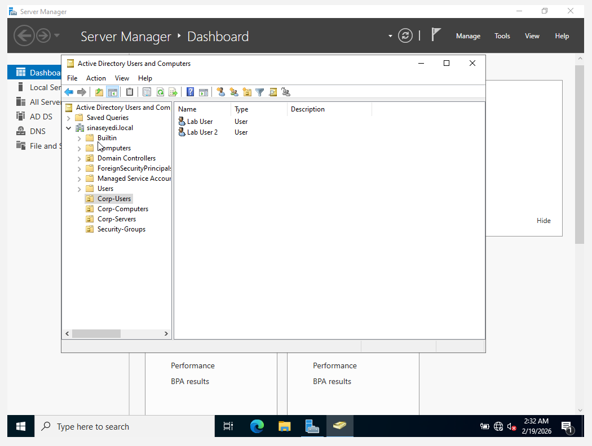
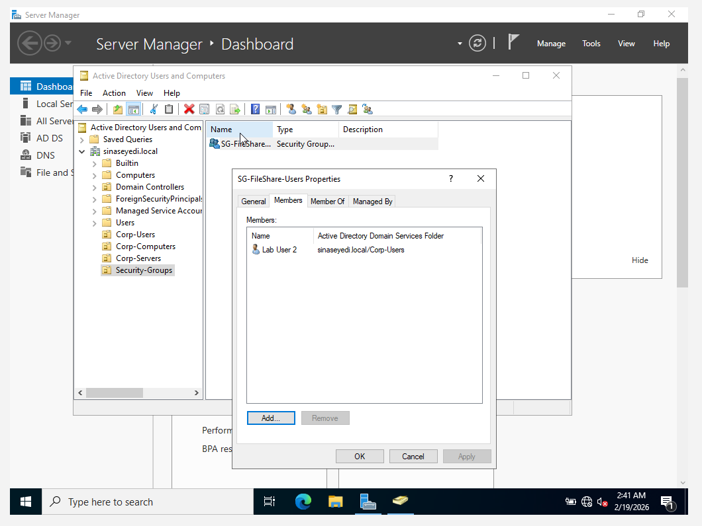

# User and Group Management

This section demonstrates common Active Directory tasks performed by IT Support and Helpdesk professionals in enterprise environments.

## Objectives

- Create Organizational Units (OUs)
- Create domain users
- Create security groups
- Add and remove users from security groups
- Verify group membership
- Simulate access control scenarios

---

## Actions Performed

- Created Organizational Unit: Corp-Users
- Created test users (e.g., LabUser1, LabUser2)
- Created Security Group: SG-FileShare-Users
- Added LabUser2 to SG-FileShare-Users
- Verified group membership using Active Directory Users and Computers
- Removed user from group to simulate access revocation

This setup simulates real-world Helpdesk tasks such as onboarding users, granting access to shared resources, and troubleshooting permissions.

---

## Skills Demonstrated

- Active Directory user management
- Security group configuration
- Access control management
- Permission troubleshooting
- Basic identity lifecycle management

## Screenshots

### 1. Users Created in Corp-Users OU

### 2. Security Group Created (SG-FileShare-Users)

### 3. User Added to Security Group

