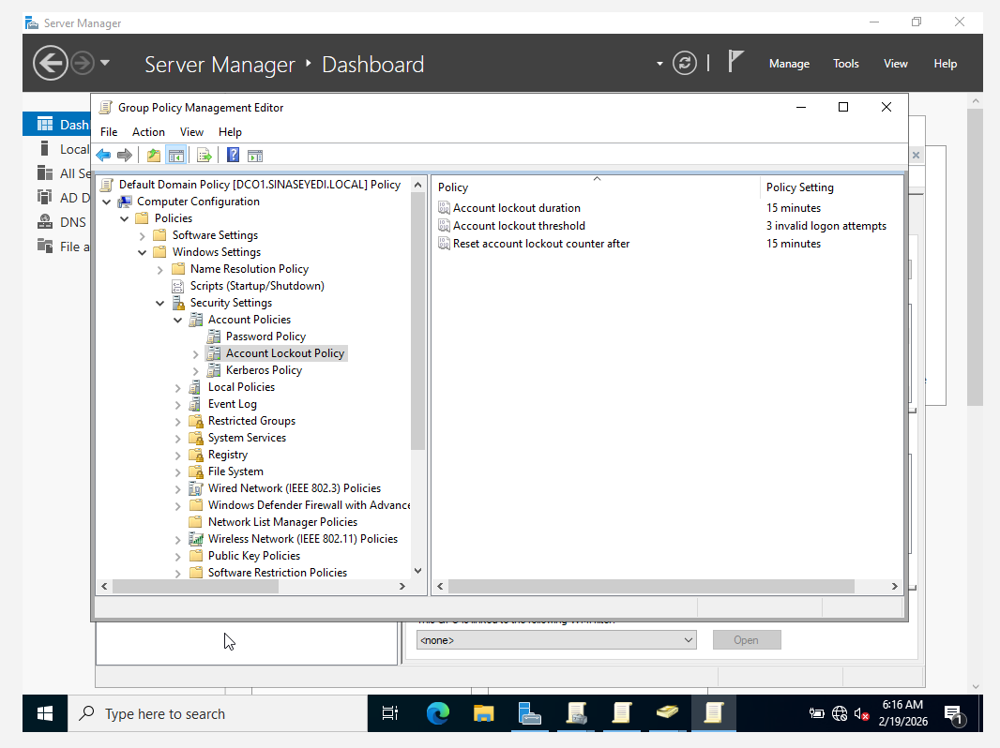
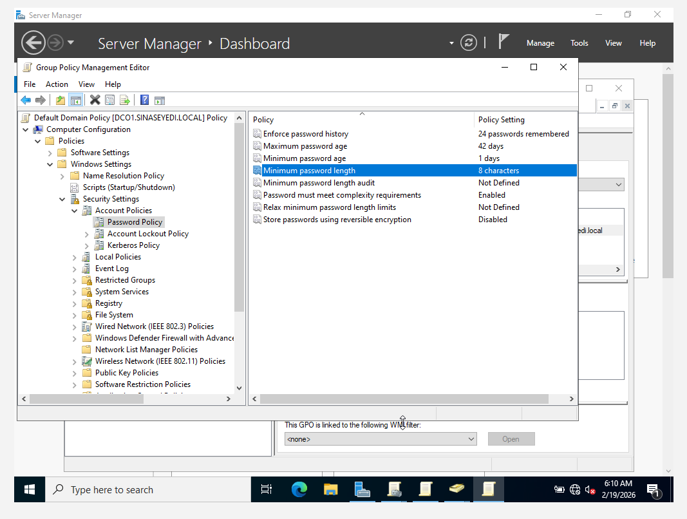
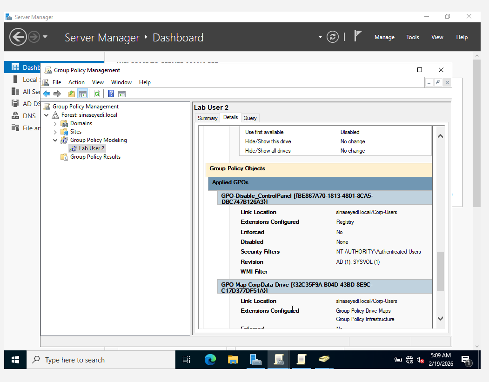

# Group Policy Configuration

This section demonstrates the implementation and validation of domain-level security policies using Group Policy Management in Windows Server 2022.

These configurations simulate real-world enterprise security standards and common Helpdesk troubleshooting scenarios.

---

## Objectives

- Configure Domain Password Policy
- Configure Account Lockout Policy
- Validate policy application
- Simulate account lockout scenario
- Demonstrate policy enforcement behavior

---

## Actions Performed

- Configured password complexity requirements
- Set minimum password length and password history
- Configured account lockout threshold (3 failed attempts)
- Set lockout duration and reset counter
- Used Group Policy Modeling to validate applied policies
- Simulated account lockout through failed login attempts

This configuration demonstrates understanding of domain-level security enforcement and user authentication behavior.

---

## Skills Demonstrated

- Group Policy Management
- Security policy configuration
- Account lockout troubleshooting
- Policy validation techniques
- Enterprise authentication controls

## Screenshots

### 1. Account Lockout Policy Configuration

### 2. Password Policy Configuration

### 3. Group Policy Modeling Validation (Lab User 2)

