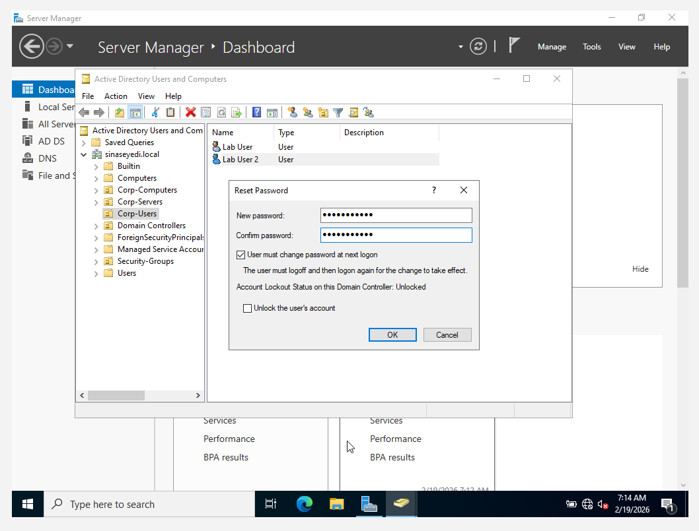
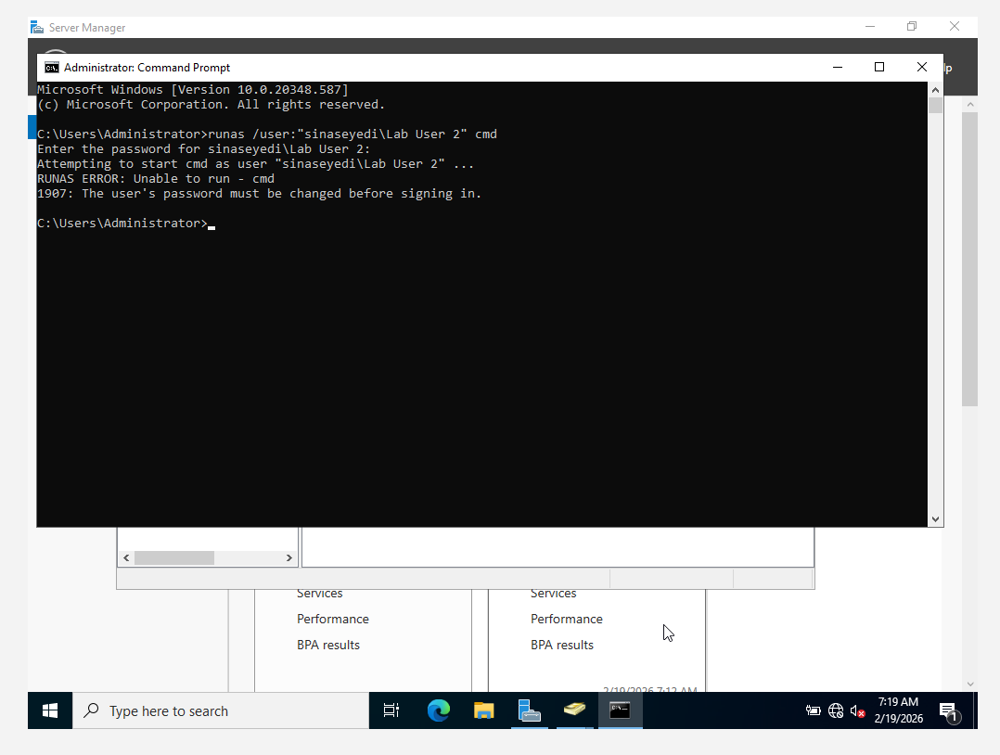
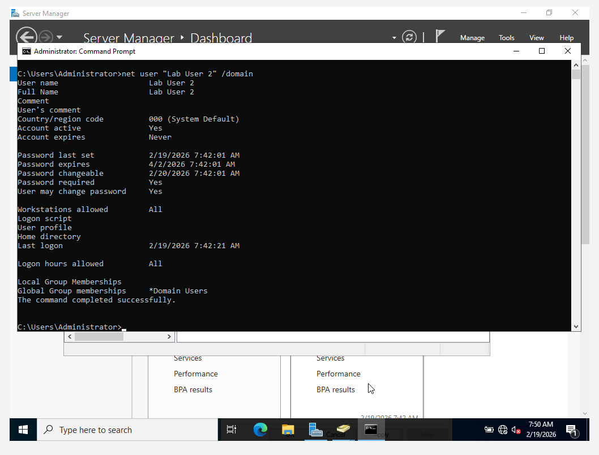

# Helpdesk Scenarios Simulation

This section demonstrates real-world Helpdesk ticket simulations performed within the Active Directory lab environment.

Each scenario includes the problem, troubleshooting steps, and resolution.

---

## Scenario 1 – User Account Locked Out

**Issue:**  
User unable to log in after multiple failed attempts.

**Troubleshooting Steps:**
- Verified account status in Active Directory
- Confirmed account lockout policy threshold (3 attempts)
- Checked lockout duration settings
- Unlocked user account manually

**Resolution:**  
Account unlocked and user successfully logged in.

**Skills Demonstrated:**
- Account lockout troubleshooting
- Policy awareness
- User support workflow

---

## Scenario 2 – User Cannot Access Shared Folder

**Issue:**  
User receives “Access Denied” when accessing \\DC01\FileShare.

**Troubleshooting Steps:**
- Verified group membership
- Confirmed NTFS permissions
- Confirmed Share permissions
- Identified user was removed from security group

**Resolution:**  
User re-added to SG-FileShare-Users and access restored.

**Skills Demonstrated:**
- Permission troubleshooting
- NTFS vs Share understanding
- Group-based access control

---

## Scenario 3 – Password Policy Enforcement

**Issue:**  
User unable to set simple password.

**Troubleshooting Steps:**
- Reviewed domain password policy
- Confirmed complexity requirement enabled
- Educated user on password standards

**Resolution:**  
User created compliant password successfully.

**Skills Demonstrated:**
- Security policy enforcement
- User guidance
- Authentication troubleshooting

### Evidence

